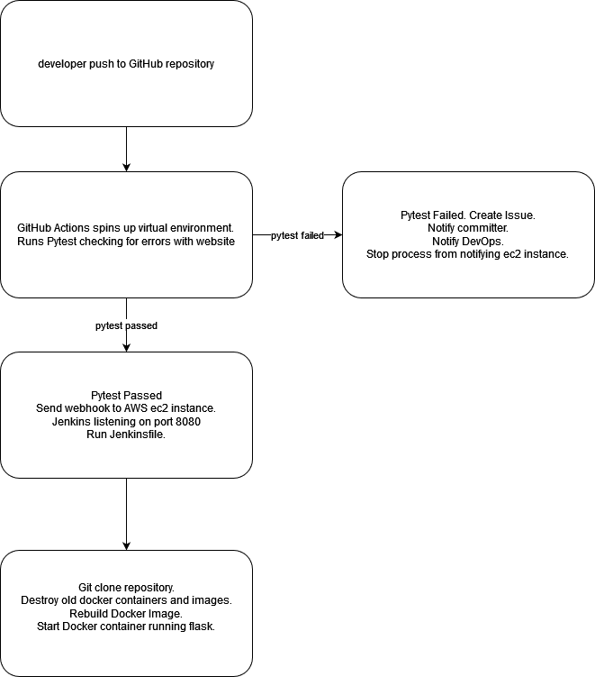

# BryonS-Project1

### Purpose
Demonstrate the Continuous Integration pipline process using GitHub, GithHub Actions, Jenkins, Docker, Docker-Compose, AWS Elastic Compute and Python.

### CI Flow Chart
