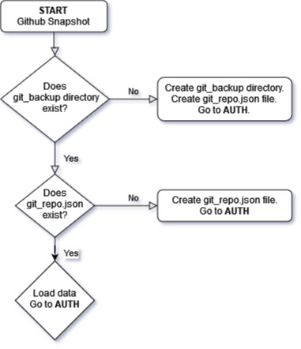
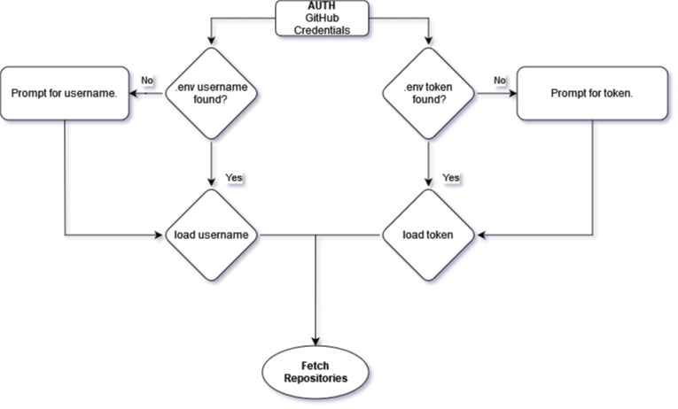
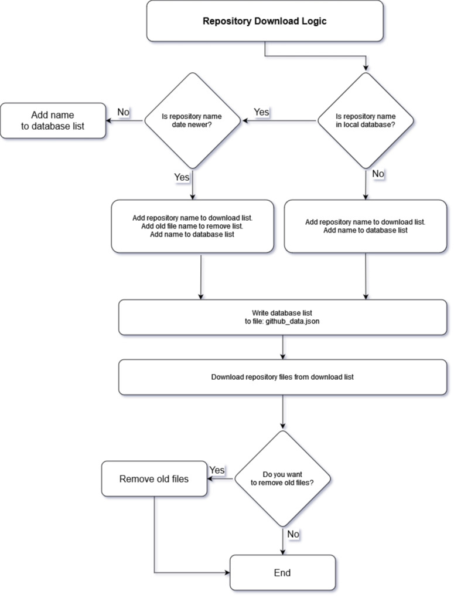

# BryonS-project0

**Create a backup of all your public, private and organization Github repositories.**

**2206-devops-batch -DevOps Project0 -Python Application**

## GitHub Snapshot

### Instructions

- Clone repository
- Install dependencies
  - `pip install -r 'requirements.txt'`
- Run: `'python main.py'` from the terminal

### Purpose

Create a backup of all your public, private and organization Github repositories. Compare changed repositories with a database of last snapshot data and only download changed or new repositories.

1. First time run -get all repositories.
2. Second time run -only get changed or new repositories.

### Challenges

- 3 days experience with the Python language, left me wanting to jump back to Typescript solutions. I had to work hard and research the Pythonic way of writing code, which is rewarding, once figured out.
- Learning the GitHub API. It was difficult to figure out why my credentials were not being accepted. After several hours of thinking it was the urllib password manager problem, I realized Github had changed to token only API credentials.
- Constructing raw HTTP headers and using the auth manager 'HTTPPasswordMgrWithDefaultRealm' to authorize my HTTP request.
- Using the datetime module.

### Ways I Improved

- Using Python to add and remove files from the file system.
- Creating complex if statement logic to control program decisions.
- Learning how to use the urllib library for HTTP request.
- Learning to use GitHub API for automation.

### Future Improvements

- Allow for more than 100 repositories to be downloaded.
- Add download bar percentage to console.
- Find orphaned files in snapshot folder (if the repository is deleted from GitHub web platform).
- Improve error handling.

### Start logic to create the directory and database file

### Auth logic for GitHub username and token

### Download logic for new or changed repositories

